# CDK Redeem Only Extension 使用教程

> 打开本页即可直接查看图文教程；需要离线保存时，可下载仓库根目录的 `教程.docx`。

## 一、下载

下载压缩包，下载链接：[https://github.com/kui123456789/cdk-redeem-only-extension](https://github.com/kui123456789/cdk-redeem-only-extension)

解压文件到任意目录，打开 Chrome 扩展管理页并开启开发者模式，点击“加载已解压的扩展程序”，选择解压后的目录。

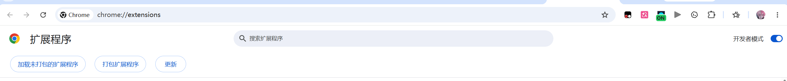

打开插件详情页。

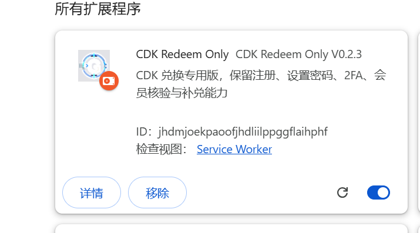

打开这两个设置。

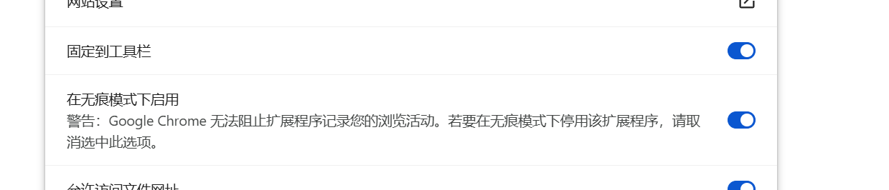

在浏览器右上角点击插件图标。

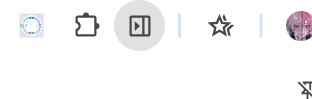

## 二、配置文件

打开插件。

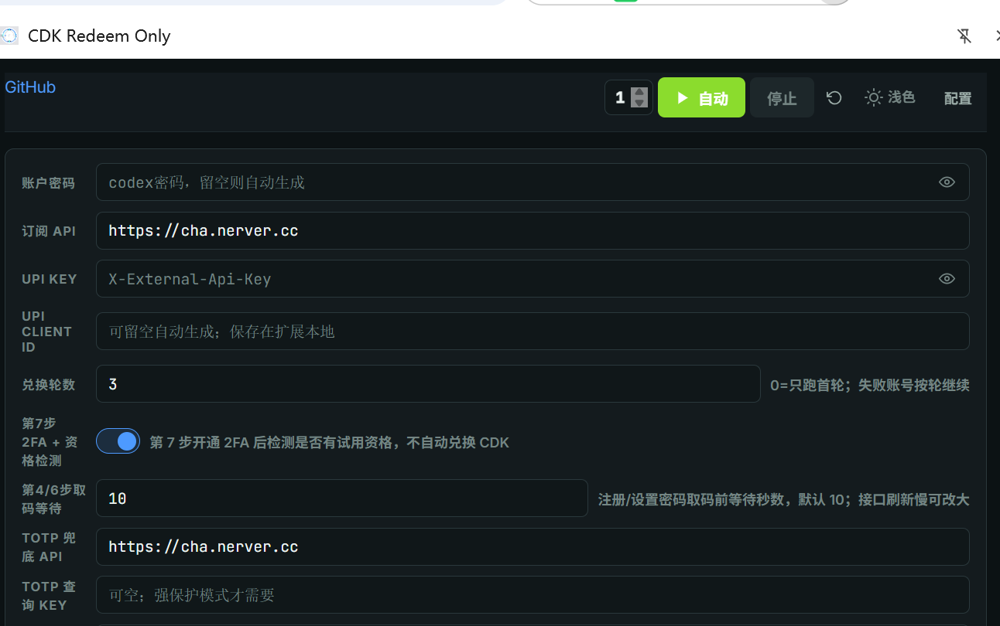

账户密码是注册 GPT 时设置的密码；留空则随机生成。

UPI Key 在网站个人中心获取，网站地址：[https://chong.nerver.cc/redeem](https://chong.nerver.cc/redeem)

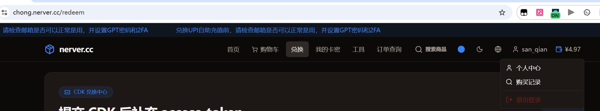

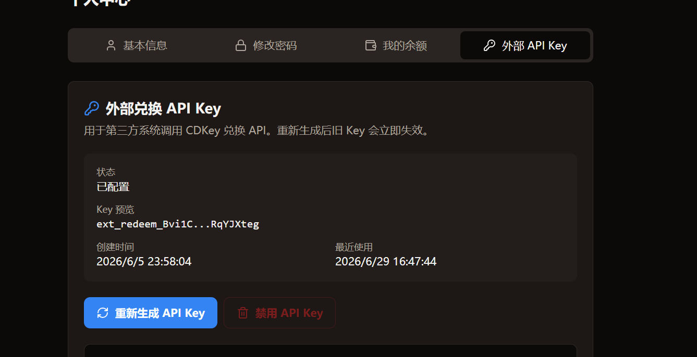

UPI Client ID 不需要手动管理。

兑换轮数指账号数量大于卡密数量时，未兑换完成的账号会在前面账号失败后自动继续使用下一个账号，直到最后一个账号结束算一轮；默认三轮。

其他配置保持默认即可。

卡密导入：在 [https://chong.nerver.cc/](https://chong.nerver.cc/) 购买卡密。注意只能使用 CDK 兑换卡密，成品号卡密无法使用；卡密支持在兑换过程中导入，会自动追加到未兑换账号。

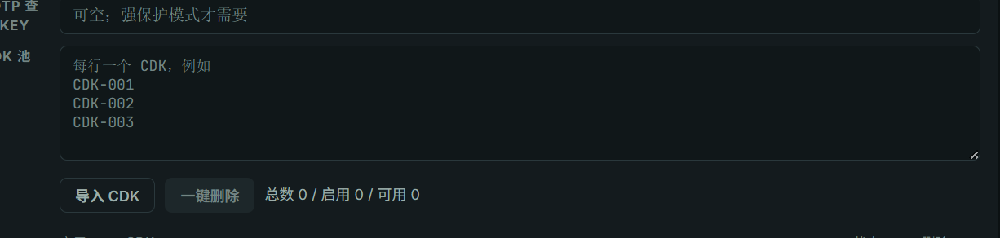

邮箱配置：邮箱购买地址为 [https://chong.nerver.cc/](https://chong.nerver.cc/)。

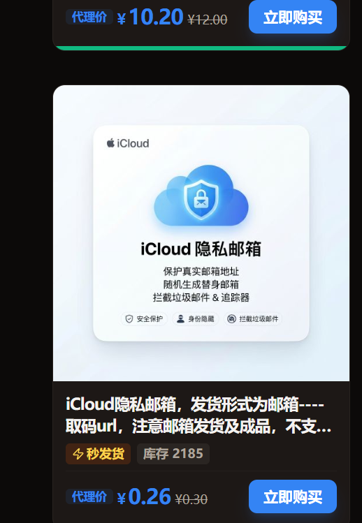

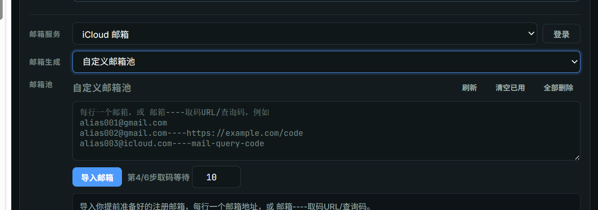

导入邮箱：点击“导入”。

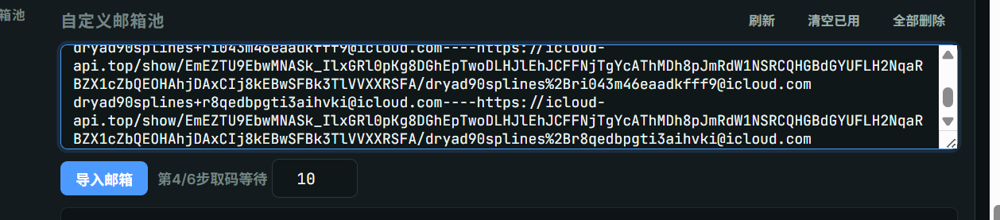

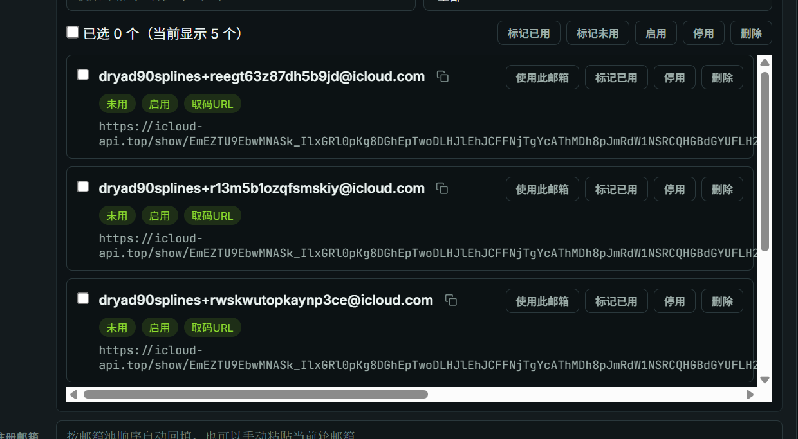

## 三、开始注册

点击右上角“自动”按钮。

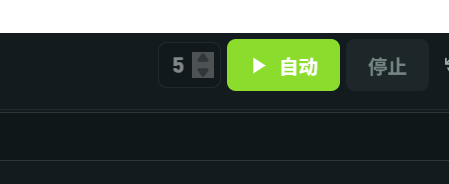

会自动注册导入邮箱的数量。注册完成后会自动检测账号是否有试用资格；有试用资格的账号会自动导入 Free 组。Free 组导出格式：邮箱---密码---2fa---at---时间戳

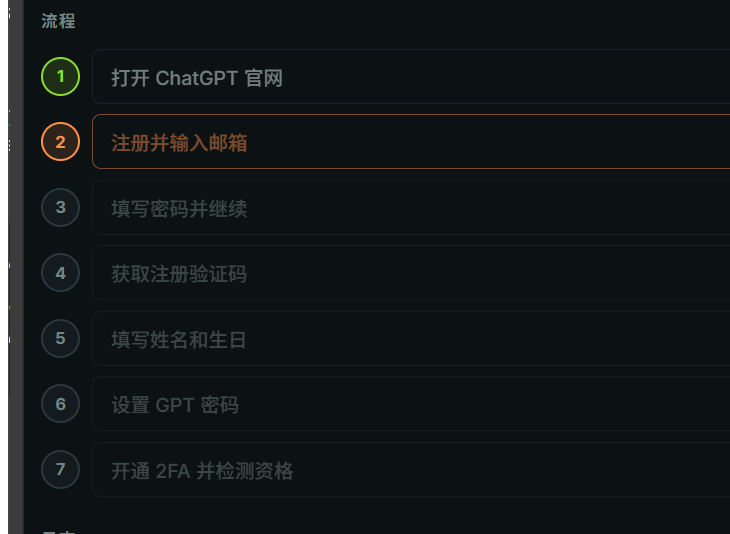

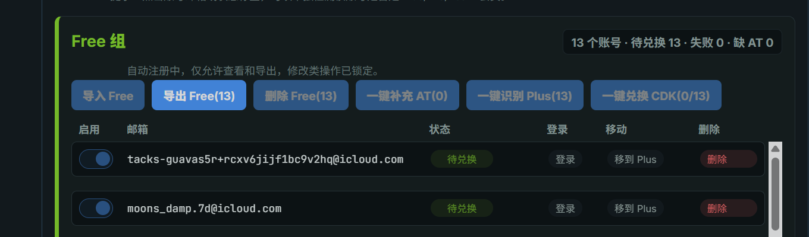

点击“一键兑换 CDK”会使用卡密进行远端兑换。

兑换成功后账号会进入 Plus 组，可在 Plus 组一键导出。导出格式：邮箱---密码---2fa---时间戳
